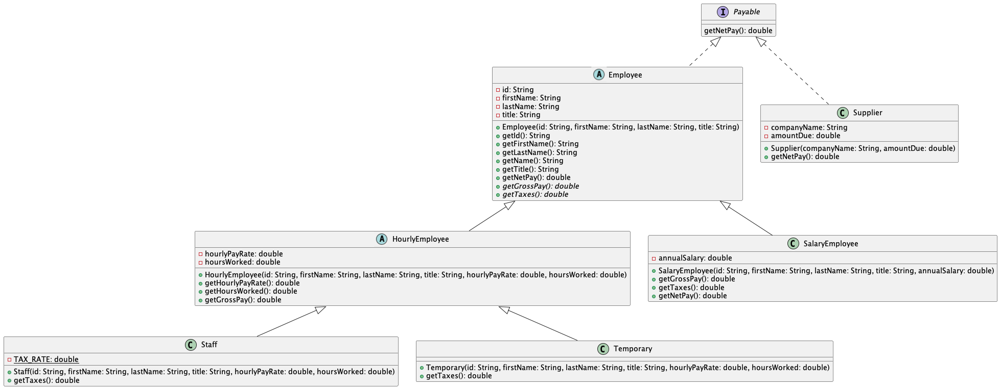

# Programming II

## Lab 5: Employee

### Employee Database

In this lab, you will practice topics related to inheritance, including practicing the use of `extends` and `implements`. You will practice using abstract classes, methods, and interfaces.

### Attribution

This lab is used in CS 222 at Saint Mary's College of California.
This lab uses the same starter code, test cases, and images as Dr. Chris Bourke's "[Lab 05](https://github.com/cbourke/CSCE156-Lab05)", which is used in CSCE 156 (Computer Science II) at the University of Nebraska-Lincoln. In 2025, Dr. Sarah Roscoe rewrote the instructions.

### Important Note

In this lab, you will write classes that depend on each other. As a result of this stacking, when trying to execute code, your IDE will warn you that the project has errors. Just keep working. When you are done with the lab, all errors should be gone.

This lab also contains images of UML diagrams. Refer back to Lab 4 for UML diagrams in general, and go [here](#uml-diagrams) if you want to review new terminology and layout specifically for inheritance.

## Instructions

1. Clone this lab from Github. Use this link: <https://github.com/sroscoe2/CS222-Lab-05.git> Refer to Lab 1 if you need a refresher for how to do so. REMEMBER: when importing, name your folder `firstnameLIpartnerLI-CS222-Lab-05`

### Employee Hierarchy

*Some* starter code in the `main` package has been provided for you, with the following files:

- `Employee.java`
- `HourlyEmployee.java`
- `SalaryEmployee.java`
- `Staff.java`
- `Temporary.java`

However, these files are completely empty. You will populate them according to the diagram below.
**Important note!** You must implement the methods and fields of the diagram *exactly*. No additional class members will be permitted.  

2. Study the following diagram. Discuss with your partner the following:

- How many classes are present? How many with starter code are provided? Which will you need to create yourselves?
- What other structures are present that you need to create?
- What are the fields and methods required?
- What classes are abstract?
- Which methods do you need to make abstract? At what point in the hierarchy will you override them?

<p align="center">

</p>

Resources for you that may be helpful:

- [More on inheritance](#inheritance)
- [More on interfaces](#about-interfaces)
- [More on abstract classes](#about-abstract-classes)
- [Information on net pay/gross pay/taxes](#about-gross-pay--taxes)

3. Create the `Payable` interface and implement per the diagram. 
4. Implement `Employee.java` per the diagram. 
5. Implement `SalaryEmployee.java` per the diagram.
6. Implement `HourlyEmployee.java`, `Staff.java`, and `Temporary.java` per the diagram.
7. Create & implement `Supplier.java` per the diagram.

### Finishing Up

8. Run `PayrollTests.java` and ensure all test cases pass.
9. Zip your project folder and turn it into Canvas. Refer to Lab 1 if you need a refresher for how to do so.

## Explanations

### Inheritance

Inheritance allows us to define classes which depend on each other in some way. In particular, it defines an "IS-A" relationship between classes. Let's examine what this means in our use case for the lab.

Many statements can be said about our diagram:

- A `SalaryEmployee` IS-A `Employee`.
- An `HourlyEmployee` IS-A `Employee`.
- A `Staff` IS-A `HourlyEmployee`, and also IS-A `Employee`.
- A `Temporary` IS-A `HourlyEmployee`, and also IS-A `Employee`.

We can discover these IS-A relationships by picking a point and going up the diagram.

[Go back to the instructions](#employee-hierarchy)

### About Abstract Classes

Abstract classes are *classes* which serve as placeholders in an inheritance hierarchy. Because they are placeholders, you are unable to create an instance of an abstract class.

A class is designated abstract in the class signature with the word `abstract`.

```java
public abstract class ExampleAbstractClass
```

Abstract classes may or may not have abstract methods. These are methods without default implementation. Abstract methods signify that any class which extends this class must override the method or be abstract themselves.

A method is designated abstract in the method signature with the word `abstract` as well.

```java
public abstract void exampleAbstractMethod(Type param1, Type param2);
```

Note that the abstract method does *not* have any curly brackets `{}`. After the parameters are provided, the abstract method ends with a semicolon.

[Go back to the instructions](#employee-hierarchy)

### About Interfaces

Interfaces are *method contracts* that we use to help get around the multiple inheritance problem in Java. They may be said to be similar to "pure abstract classes", which means they usually contain purely abstract methods.

Interfaces are not classes. We cannot create instances of an interface. They are useful, however, to identify a method that potentially many classes may have to implement.

We can invoke the use of an interface with the `implements` keyword in the class signature. For example:

```java
public class ExampleClass implements ExampleInterface
```

Interfaces also support the IS-A relationship. In our case, any kind of `Employee` IS `Payable`, since the `Employee` class implements `Payable`.

If one class `C` implements an interface, that method will be inherited among all classes that extend `C`.

[Go back to the instructions](#employee-hierarchy)

### About Gross Pay & Taxes

Everyone who works has a gross pay, that is, the pay before any income taxes are taken out. Most workers have taxes that are taken out of their gross pay. Consult the following table for specific information per the kind of employee.

| Kind of Employee    | Type Name   | Gross Pay                                                                                      | Taxes                                                            | Net Pay                                                         | Other/Notes                                                                                     |
| ------------------- | ----------- | ---------------------------------------------------------------------------------------------- | ---------------------------------------------------------------- | --------------------------------------------------------------- | ----------------------------------------------------------------------------------------------- |
| Employee (general)  | n/a         | n/a                                                                                            | n/a                                                              | Gross pay minus taxes                                           | All employees have employee ID, first & last name, job title                                    |
| Salaried            | `Salary`    | Weekly salary                                                                                 | 20% each pay period                                                    | Calculated gross pay, minus taxes, with post-tax $100 benefit allowance | All salaried employees have a base annual salary that is divided equally among all weeks of the year.                                               |
| Hourly (general)    | n/a         | Hourly pay rate multiplied by hours worked.<br>(For example, $15/hour rate for 5 hours worked in the week) | n/a                                                              | see Employee (general)                                          | Hourly employees have a per-hour pay rate, and a sum of hours worked each week.                                                      |
| Hourly -- Staff     | `Staff`     | see hourly (general)                                                                           | 15%                                                             | see Employee (general)                                          | n/a                                                                                             |
| Hourly -- Temporary | `Temporary` | see hourly (general)                                                                           | 0% (they're employed through external agency which covers taxes) | see Employee (general)                                          | n/a                                                                                             |
| Supplier            | n/a         | n/a                                                                                            | n/a                                                              | n/a                                                             | Don't work for the company, so not employees. But they do need to be paid their **amount due**. |

[Go back to the instructions](#employee-hierarchy)

### UML Diagrams

Refer back to Lab 04 [here](https://github.com/sroscoe2/CS222-Lab-04/#uml-diagram) if you want a general refresher on how UML diagrams work.

In this lab, you will work off a diagram.

<p align="center">

</p>

Here are some insights about this picture:

- **Arrows indicate `extends`.** An arrow pointing from class `B` to class `A` indicates that `B extends A`. This trail can be repeated until we arrive at the base class (in our case, Employee).
- **Abstract classes have a different icon.** Instead of the usual green "C", they are indicated to be abstract because of their blue "A".
- **Abstract methods are in italics.** These indicate methods that should have no default implementation within that class.
- **Abstract methods are regular (non-italic) when they are overridden**. Take a look at `getGrossPay()`. It is abstract (italic) in `Employee`, but not italic in both `HourlyEmployee` and `SalaryEmployee`. This indicates that gross pay should be defined in those respective classes.
- **Interfaces have a different icon.** Instead of "C" for class, or "A" for abstract, the interface icon is a purple "I". Methods, with their parameters and return types, are listed in the interface's box.
- **Implementation of interfaces are denoted with dashed arrows**. Since an interface is not a class, using a solid-line arrow would be confusing. A dashed arrow is used instead. A dashed arrow from class `X` to interface `Y` indicates that `X implements Y`.
- `final` variables are written with all-caps and are underlined.

[Go back to the instructions](#instructions)